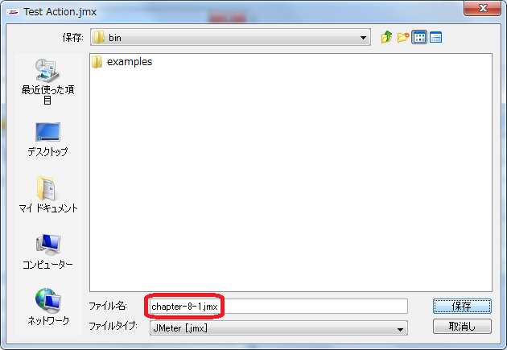

# GUIなしで実行する

以下のような場合にGUIなしで実行したいことがあります。

+ GUIをインストールしていないLinuxサーバで実行
+ スクリプトから起動する

今回はGUIなし起動・終了するシナリオを作成します。

## 使用コンポーネント

+ 「TestAction」サンプラー

## 前提
以下ができること

1. JMeterを起動する。
（[起動する](1.start.md "起動する")参照）

## 手順
### 手順説明

1. 「TestAction」サンプラーを設定します
1. シナリオを保存します
1. GUIなしで起動します
1. コマンドラインから終了します

### 手順実行
#### 1. 「TestAction」サンプラーを設定

1. [テスト計画]を右クリックして [追加] > [Threads(Users)] > [スレッドグループ] を選びます。
2. [スレッドグループ]を右クリックして [追加] > [サンプラー] > [TestAction] を選びます。
3. [TestAction]を選択します。[Duration]に 100000 を入力します。


#### 2. シナリオを保存

1. フロッピーディスクアイコンをクリックします。
1. ダイアログが表示されるので chapter-8-1.jmx と名前を付けて保存します。



#### 3. GUIなしで起動

1. コマンドプロンプトを起動し、次のコマンドを実行します。

```
apache-jmeter-2.9\bin\jmeter.bat -n -t chapter-8-1.jmx
```

コマンドラインオプションの意味は次の通りです。
<table>
	<tr><td>-n</td><td>non-GUIで実行</td></tr>
	<tr><td>-ｔ</td><td>シナリオファイルを指定</td></tr>
</table>

起動メッセージが表示されます。

```
Created the tree successfully using chapter-8-1.jmx
Starting the test @ Mon Jul 08 18:50:10 JST 2013 (1373277010483)
Waiting for possible shutdown message on port 4445
```

JMeterはデフォルトで4445ポートを使用して終了メッセージを待ちます。
初めて起動する場合はファイアーウォールの警告が出ることがあります。
通信を許可してください。

linuxの場合は次のコマンドを使ってください

```
apache-jmeter-2.9/bin/jmeter -n -t chapter-8-1.jmx
```

#### 4. コマンドラインから終了

1.もう一つコマンドプロンプトを起動し、次のコマンドを実行します。

```
apache-jmeter-2.9\bin\shutdown.cmd
```

ポート4445に終了メッセージを送ります。

```
Sending Shutdown request to port 4445
```


最初のコマンドプロンプトに終了メッセージが表示されます。

```
Command: Shutdown received from /127.0.0.1
Tidying up ...    @ Mon Jul 08 19:21:24 JST 2013 (1373278884084)
... end of run
```

linuxの場合は次のコマンドを使ってください

```
apache-jmeter-2.9/bin/shutdown.sh
```

JMeterをGUIなしで複数起動した場合は、自動的に+1した待ち受けポートで起動します。
4445以外のポートを使用しているJMeterを終了したい場合はshutdownコマンドの引数でポートを指定します。

```
apache-jmeter-2.9\bin\shutdown.cmd 4446
```


## シナリオファイル
[chapter-8-1.jmx](scenarios/chapter-8-1.jmx)